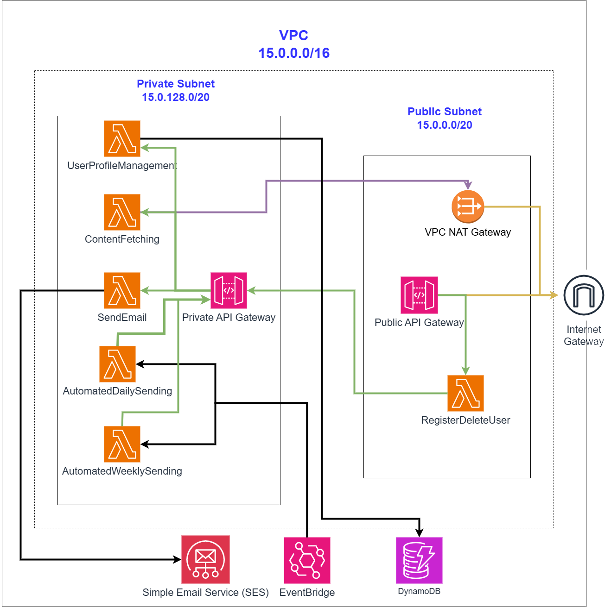
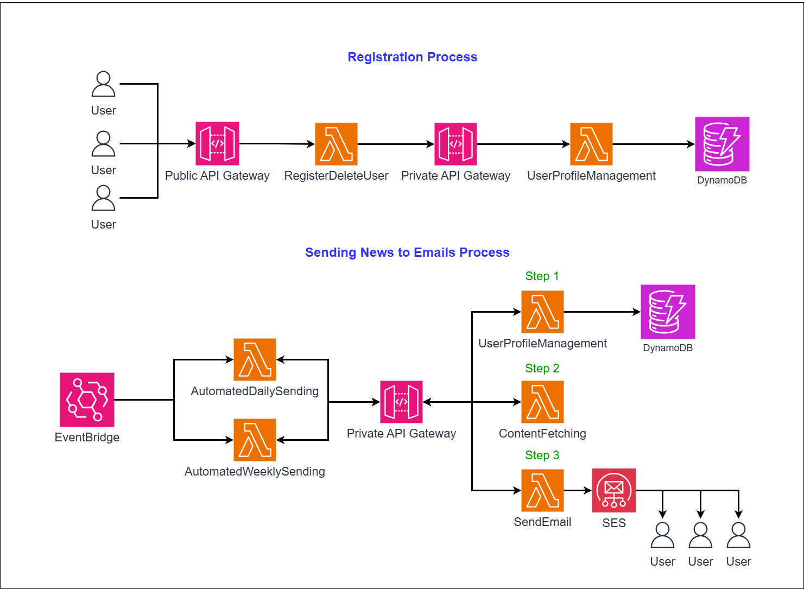

# Personalized AWS News System

This project is a cloud-based backend application built on **Amazon Web Services (AWS)** that delivers personalized news to users via email.
It leverages a **serverless architecture** with Lambda functions, DynamoDB, SES, and EventBridge to automate news fetching and delivery.

## Architecture

### System Architecture

### Microservices

## Features
- User registration & deregistration via **API Gateway**
- **News fetching** from NewsAPI.org
- **User profile management** in DynamoDB
- Automated **daily/weekly personalized news emails**
- Email delivery via **AWS SES**

## Repository Contents
- `lambdas/` – Source code of all AWS Lambda functions
- `docs/` – Full report with screenshots and diagrams
- `README.md` – Project overview

## Full Report
See [Full Report](docs/report.md) for detailed explanation, methodology, screenshots, and results.
