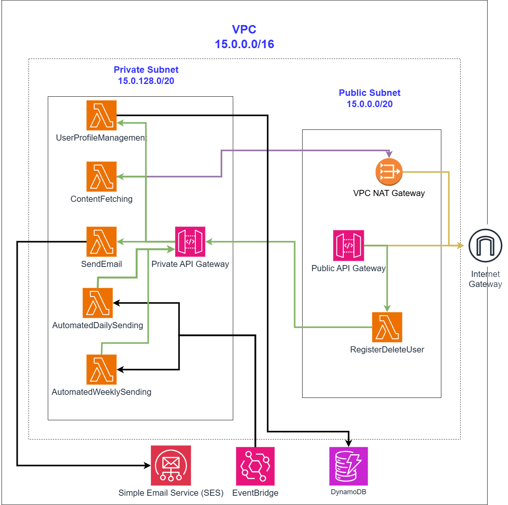

# Personalized Cloud-based News System

## Abstract
This report presents the design and implementation of a Personalized News System, a cloud-based backend application leveraging Amazon Web Services (AWS) to deliver curated news content to users via email. The system addresses the challenge of information overload in today's digital landscape by personalizing content based on user preferences. Utilizing a serverless architecture, the system integrates six core services: content fetching, email sending and verification, user profile management, automated daily/weekly email sending, and a public registration/deregistration service. News articles are fetched from NewsAPI.org and tailored to individual user chosen categories. Automation ensures timely delivery of daily or weekly updates. The implementation demonstrates the use of modern cloud computing principles, emphasizing scalability, and efficiency.

## Table of Contents
- Abstract
- Introduction
- Problem Statement
- System Architecture and Diagrams
    - Architecture Diagram
    - Microservice Diagram
- Components
    - Component List and Methodology
    - Other Components
- Services and API Implementation
    - Public API Gateway
    - Private API Gateway
- Workload Characterization
- Conclusion
- Snapshots
- Appendix (Code)
- References

## Introduction
The Personalized News System is a cloud-based backend application designed on Amazon Web Services (AWS) that delivers tailored news content to users’ emails. By utilizing a serverless architecture, the system can dynamically recommend articles based on each user’s interests and chosen frequency. It fetches the news from the News API (NewsAPI.org). Six main services form the core of the application: content fetching, email sending and verification checking, user profile management and database queries, automated email notifications, and registering or deregistering for the system. Only the latter is public (accessible via a public API Gateway), while the others remain in the private subnet behind a private API Gateway.

## Problem Statement
In today’s fast-paced digital world, users are constantly bombarded with information, making it challenging to find relevant news content tailored to their interests. Generic news feeds lack personalization, which can lead to information overload and reduce engagement. This project aims to provide a solution by creating a personalized news system that curates news articles based on user preference and sends it to their emails, either daily or weekly. Thus, the system will not only output relevant articles, but also automate email notifications with the personalized articles suggestions, based on the user’s choice of frequency, ensuring users stay informed on topics that matter most to them whenever they need.

## System Architecture and Diagrams

### Architecture Diagram



### Microservice Diagram
(See diagrams above.)

## Components

### Component List and Methodology

**RegisterDeleteUser**  
**Purpose:** The only public service. Allows users to register or deregister from the system.  
**Implementation:** AWS Lambda function. Routes through the Private API Gateway to reach the UserProfileManagement service managing the DynamoDB table.  
**Interface:** RESTful API via Public API Gateway.

**ContentFetching**  
**Purpose:** Retrieve specific news articles from NewsAPI.org based on selected categories.  
**Implementation:** AWS Lambda function. Fetches via external APIs; filters based on parameters.  
**Interface:** RESTful API via Private API Gateway.

**SendEmail**  
**Purpose:** Send personalized email notifications to users with curated news recommendations.  
**Implementation:** Lambda function that uses Amazon SES for email dispatch.  
**Interface:** RESTful API via Private API Gateway.

**UserProfileManagement**  
**Purpose:** Store and manage user profiles: name, email, sending preferences (daily, weekly), and preferred news category.  
**Implementation:** Serverless Lambda managing data in DynamoDB.  
**Interface:** RESTful API via Private API Gateway.

**AutomatedDailySending**  
**Purpose:** Automatically send daily emails to users containing articles of their choice.  
**Implementation:** Lambda integrating UserProfileManagement, ContentFetching, and SendEmail. Triggered by EventBridge.  
**Interface:** No input parameters; triggered by EventBridge.

**AutomatedWeeklySending**  
**Purpose:** Automatically send weekly emails to users containing articles of their choice.  
**Implementation:** Lambda integrating UserProfileManagement, ContentFetching, and SendEmail. Triggered by EventBridge.  
**Interface:** No input parameters; triggered by EventBridge.

> Note: For HTTP/RESTful requests within the Lambdas (inter-service communication), the `requests` library was packaged as a Lambda Layer and attached to functions that need it.

### Other Components

**DynamoDB**: A table named `UserProfile` stores user name, email, article category preference, and sending frequency (daily/weekly). Email is the partition key.  
**EventBridge**: Triggers AutomatedDailySending (daily at 12 AM) and AutomatedWeeklySending (Sundays at 12 AM).  
**SES**: Used as the backbone for email dispatch in sandbox mode.  
**IAM Policies**: Each Lambda has least-privilege IAM permissions (e.g., DynamoDB access for UserProfileManagement, SES access for SendEmail).

#### EventBridge Rules

| Rule | Description | Cron Expression | Target Lambda |
|---|---|---|---|
| DailyEmailRule | Run AutomatedDailySending Lambda daily (12 AM) | `0 21 * * ? *` | AutomatedDailySending |
| WeeklyEmailRule | Run AutomatedWeeklySending Lambda weekly (Sunday 12 AM) | `0 21 ? * 7 *` | AutomatedWeeklySending |

## Services and API Implementation

### Public API Gateway

| Service (Lambda) | Description | Method | Route |
|---|---|---|---|
| RegisterDeleteUser | Registration & deregistration service (public) | POST | `/RegisterDeleteUser` |

### Private API Gateway

| Service (Lambda) | Description | Method | Route |
|---|---|---|---|
| ContentFetching | Fetch articles from NewsAPI.org | POST | `/ContentFetching` |
| SendEmail | Send emails via AWS SES (with verification checks) | POST | `/SendEmail` |
| UserProfileManagement | Query and manage DynamoDB users table | POST | `/UserProfileManagement` |

## Workload Characterization

**Public API Gateway**

`POST /RegisterDeleteUser`
```json
{{
  "action": "add/remove",
  "name": "name",
  "email": "email",
  "preference": "news_category",
  "frequency": "daily/weekly"
}}
```

**Private API Gateway**

`POST /ContentFetching`
```json
{{
  "category": "news_category"
}}
```

`POST /SendEmail`
```json
{{
  "source_email": "email",
  "recepient_email": "email",
  "subject": "text",
  "body": "text"
}}
```

`POST /UserProfileManagement`
```json
{{
  "action": "add/remove",
  "name": "name",
  "email": "email",
  "preference": "news_category",
  "frequency": "daily/weekly"
}}
```

Or:
```json
{{
  "action": "readEntireTable"
}}
```

Or:
```json
{{
  "action": "readOneEntry",
  "email": "email"
}}
```

> Supported news categories match those on NewsAPI.org (e.g., business, entertainment, general, health, science, sports, technology).
> The actions `readEntireTable` and `readOneEntry` are used by the AutomatedDailySending and AutomatedWeeklySending Lambdas.

## Conclusion
The Personalized News System demonstrates how cloud-based solutions enhance user experience via relevant and tailored content. By leveraging a serverless architecture, the system remains cost-effective and scalable. Automation through EventBridge + Lambda ensures timely delivery of personalized news without manual intervention. The modular design provides a foundation for future enhancements (e.g., ML-driven personalization or additional news sources).

## Snapshots
Below are the snapshots extracted from the report, in original order:


## Appendix (Code)

### RegisterDeleteUser Lambda Function
```python
import json
import requests

def lambda_handler(event, context):
    try:
        if (event["action"] == "add"):
            url = 'https://xxxxxxxx.execute-api.us-east-1.amazonaws.com/stage1'
            params = {
                'action': event["action"],
                "email": event["email"],
                "name": event["name"],
                "preference": event["preference"],
                "frequency": event["frequency"]
            }
            # Make the POST request
            response = requests.post(url + '/UserProfileManagement', json=params)
            dataResponse = response.json()
            return {
                'statusCode': 200,
                'response': dataResponse
            }
        elif (event["action"] == "remove"):
            url = 'https://xxxxxxxxx.execute-api.us-east-1.amazonaws.com/stage1'
            params = {
                'action': event["action"],
                "email": event["email"],
            }
            response = requests.post(url + '/UserProfileManagement', json=params)
            dataResponse = response.json()
            return {
                'statusCode': 200,
                'response': dataResponse
            }
        else:
            return  {"message": "undefined action", "data": event}
    except:
        raise
```

### ContentFetching Lambda Function
```python
import json
import requests  # now available due to the layer

def lambda_handler(event, context):
    try:
        api_key = 'xxxxxxxxxxxxxxx'
        url = 'https://newsapi.org/v2/top-headlines'
        params = {
            'category': event['category'],
            'language': 'en',
            'apiKey': api_key,
            'pageSize': 3
        }
        # Make the GET request
        response = requests.get(url, params=params)
        data = response.json()
        list1 = list()
        # Optionally print articles to CloudWatch logs
        for article in data.get('articles', []):
            dict1 = dict()
            dict1['title'] = article['title']
            print('Title: ' + article['title'])
            dict1['url'] = article['url']
            print('url: ' + article['url'])
            dict1['publishedAt'] = article['publishedAt']
            print('publishedAt: ' + article['publishedAt'])
            print()
            list1.append(dict1)
        # Return the data as a JSON response
        return {
            'statusCode': 200,
            'headers': {'Content-Type': 'application/json'},
            'body': list1
        }
    except: 
        raise
```

### UserProfileManagement Lambda Function
```python
import json
import boto3

ses_client = boto3.client('ses')
dynamodb_client = boto3.resource('dynamodb')
table = dynamodb_client.Table('UserProfile')

def lambda_handler(event, context):
    try:
        action = event.get('action')
        if action == 'add':
            email = event.get('email')
            name = event.get('name')
            preference = event.get('preference')
            frequency = event.get('frequency')
            response=table.put_item(Item={'email':email,
                                          'name': name,
                                          'preference': preference,
                                          'frequency' :frequency})
            verifyMessage = ""
            if(not verifyEmail(email)): 
                verifyMessage = ", check your email for verification"
            return {"message": "added/modified entry" + verifyMessage, "response": response}
        elif action == "remove":
            email = event.get('email') # get key
            if not email:
                raise ValueError("Key information is missing from the event.")
            # Check if the item exists in the table
            get_response = table.get_item(Key= {"email": email})
            ses_client.delete_identity(Identity=email)
            if 'Item' not in get_response:
                return {
                    "message": "Item not found in the table",
                    "statusCode": 500
                }
            response = table.delete_item(Key= {"email": email})
            return {"message": email + " deleted", "response": response}
        elif action == 'readEntireTable':
            return  {"message": "entire table fetched", "response": table.scan()}
        elif action == 'readOneEntry':
            email = event.get('email')
            response = table.get_item(Key= {"email":email})
            return {"message": email + " entry fetched", "response": response}
        else:
            return  {"message": "undefined action", "data": event}
    except:
        raise

def verifyEmail(email):
    try:
        # List verified email addresses
        response = ses_client.list_verified_email_addresses()
        verified_emails = response.get('VerifiedEmailAddresses', [])
        if email in verified_emails:
            return True
        # If not verified, request email verification
        ses_client.verify_email_identity(EmailAddress=email)
        return False
    except:
        raise
```

### SendEmail Lambda Function
```python
import json
import boto3

ses_client = boto3.client("ses")

def lambda_handler(event, context):
    try:
        subject = event['subject']
        source_email = event['source_email']
        recepient_email = event['recepient_email']
        body = event['body']

        if (not verifyEmail(source_email)):
            return {"message": "source mail needs verification, verification email sent", "statusCode": 500}

        if (not verifyEmail(recepient_email)):
            return {"message": "recepient mail needs verification, verification email sent", "statusCode": 500}

        message = {"Subject": {"Data": subject}, "Body": {"Html": {"Data": body}}}

        response = ses_client.send_email(Source = source_email,
                                         Destination = {"ToAddresses": [recepient_email]},
                                         Message = message)

        return {"message": "email sent successfully", "response": response}
    except:
        raise

def verifyEmail(email):
    try:
        # List verified email addresses
        response = ses_client.list_verified_email_addresses()
        verified_emails = response.get('VerifiedEmailAddresses', [])
        if email in verified_emails:
            return True
        # If not verified, request email verification
        ses_client.verify_email_identity(EmailAddress=email)
        return False
    except:
        raise
```

### AutomatedDailySending Lambda Function
```python
import json
import requests

def lambda_handler(event, context):
    try:
        url = 'https://xxxxxxx.execute-api.us-east-1.amazonaws.com/stage1'
        params = {'action': "readEntireTable"}
        # Make the POST request
        response = requests.post(url + "/UserProfileManagement", json=params)
        data = response.json()
        listOfEntiries = data["response"]["Items"]
        for entry in listOfEntiries:
            if entry['frequency'] == "daily":
                params = {'category': entry['preference']}
                # Make the POST request
                response = requests.post(url + "/ContentFetching", json=params)
                data = response.json()
                personalNewsList = data["body"]
                entireMessageBody = "Here are your personalized news:<br />"
                # Note <br /> = \n functionality in HTML
                for article in personalNewsList:
                    # the format of 'publishedAt': '2024-12-14T11:42:36Z', so we will use split to take just the date
                    messageBody = f"""<br />{article['title']}. <br /> To check the source, Press: {article['url']} <br />
                    published At {article['publishedAt'].split("T")[0]}. <br />"""
                    entireMessageBody = entireMessageBody + messageBody
                params = {
                    "source_email": "xxxxxxxxxxxx@gmail.com",
                    "recepient_email": entry["email"],
                    "subject": f"{entry['name']}, Your Personalized News in {entry['preference']}",
                    "body": entireMessageBody
                }
                response = requests.post(url + "/SendEmail", json=params)
                output = response.json()
        return {
                "message": "Daily email successfully sent. ",
                'statusCode': 200
            }
    except:
        raise
```

### AutomatedWeeklySending Lambda Function
```python
import json
import requests

def lambda_handler(event, context):
    try:
        url = 'https://xxxxxx.execute-api.us-east-1.amazonaws.com/stage1'
        params = {'action': "readEntireTable"}
        # Make the POST request
        response = requests.post(url + "/UserProfileManagement", json=params)
        data = response.json()
        listOfEntiries = data["response"]["Items"]
        for entry in listOfEntiries:
            if entry['frequency'] == "weekly":
                params = {'category': entry['preference']}
                # Make the POST request
                response = requests.post(url + "/ContentFetching", json=params)
                data = response.json()
                personalNewsList = data["body"]
                entireMessageBody = "Here are your personalized news:<br />"
                # Note <br /> = \n functionality in HTML
                for article in personalNewsList:
                    # the format of 'publishedAt': '2024-12-14T11:42:36Z', so we will use split to take just the date
                    messageBody = f"""<br />{article['title']}. <br /> To check the source, Press: {article['url']} <br />
                    published At {article['publishedAt'].split("T")[0]}. <br />"""
                    entireMessageBody = entireMessageBody + messageBody
                params = {
                    "source_email": "xxxxxxxxxxx@gmail.com",
                    "recepient_email": entry["email"],
                    "subject": f"{entry['name']}, Your Personalized News in {entry['preference']}",
                    "body": entireMessageBody
                }
                response = requests.post(url + "/SendEmail", json=params)
                output = response.json()
        return {
                "message": "Weekly email successfully sent. ",
                'statusCode': 200
            }
    except:
        raise
```

## References
- Various course material.
- Amazon Web Services Documentation: AWS Lambda Developer Guide: Serverless Computing.
- NewsAPI Documentation: https://newsapi.org/docs
- Amazon DynamoDB Documentation: https://aws.amazon.com/documentation/dynamodb/
- Amazon SES Documentation: https://aws.amazon.com/documentation/ses/
- Serverless Framework Documentation: https://www.serverless.com/framework/docs/
- TechTarget: Understanding Serverless Computing and Its Benefits.
